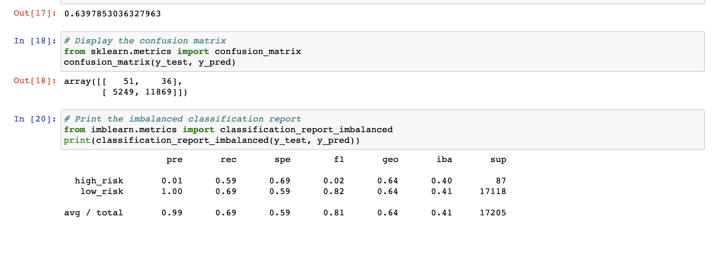
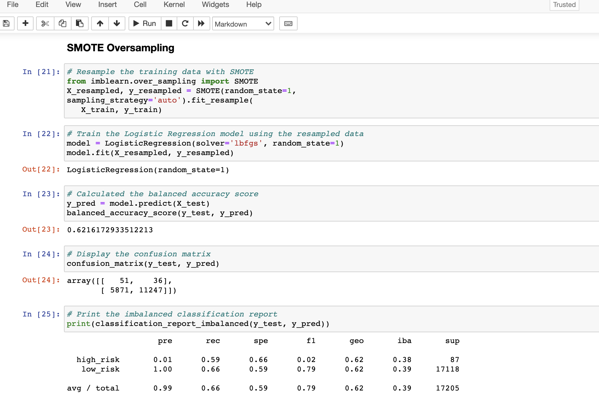
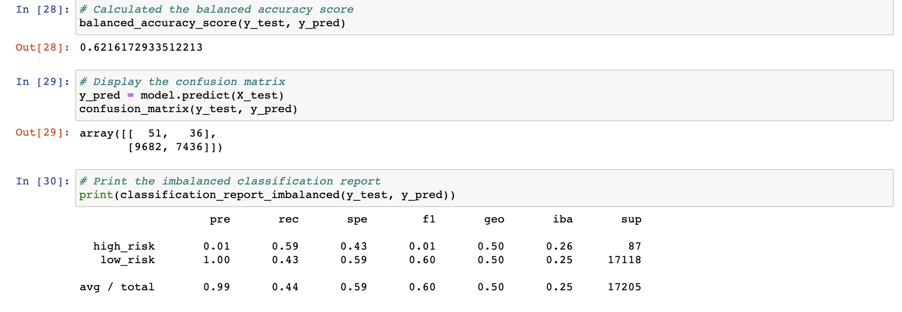
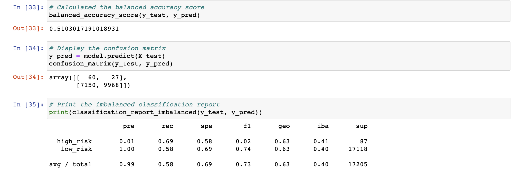
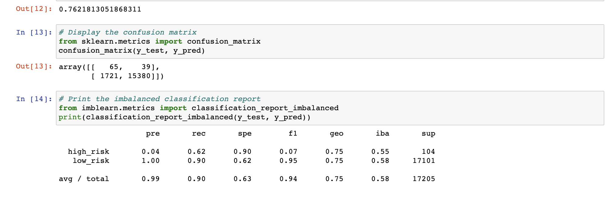
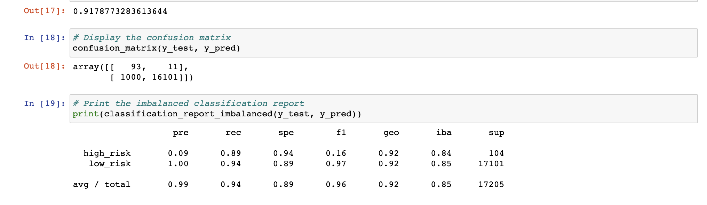

# Credit_Risk_Analysis
Using our knowledge of the imbalanced-learn and scikit-learn libraries to evaluate three machine learning models by using resampling to determine which is better at predicting credit risks.

### Overview of the Analysis

The main objective of this analysis consist of analyzing how different machine learning models can assist in predicting credit card risk. Few steps are required within these models to gauge whether someone is classified "high or "low" risk. For instance, before capturing any of the results, it was important to seperate the data in two categories; training & testing Data. Once accomplished, we could then proceed with the different techniques such as RandomOversampler, SMOTE, ClusteerCentroid, SMOTEENN, and others to capture the neccessary results. 

### Results
--------------------------------------------------------
The first Test we ran was the Naive Random Oversampling, and it provided the following results
Balance Accuracy: 64%
Precision for High-risk has a low positivity at 1%
The Recall sits at 69%

-----------------------------------------------------------------------
* SMOTE Oversampling Results are as follow:

Balance Accuracy: 62%
Precision for High-Risk loans at a low Positivity of 1%
Recall sits at 66%

-----------------------------------------------------------------------
* The Undersampling Results are as Follow:

Balance Accuracy: 62%
Precision for High-Risk loans at a low Positivity of 1%
Recall sits at 44%

-----------------------------------------------------------------------

* The combination (Over & undersampling) results are as follow:

Balance Accuracy: 51%
Precision for High-Risk of 1% , 
Recall sits at 58%

-----------------------------------------------------------------------

* THe Balanced Random Forest Classifier Results are as follow:

Balance Accuracy: 76%
Precision for High-Risk loans at a low Positivity of 4% , avg precision is at 99%
Recall sits at 90%

----------------------------------------------------------------------

* The Easy Ensemble AdaBoost Classifier Results are as follow:

Balance Accuracy: 91%
Precision for High-Risk loans at a low Positivity of 9% , avg precision is at 99%
Recall sits at 94%

----------------------------------------------------------------------

### Summary of the Results

Using all the above models, we are now able to analyze whihc model best predicts the resuls we seek to assess. 
Random oversampling involves randomly duplicating examples in the minority class, whereas random undersampling involves randomly deleting examples from the majority class. As these two transforms are performed on separate classes, the order in which they are applied to the training dataset does not matter.
SMOTE works by selecting examples that are close in the feature space, drawing a line between the examples in the feature space and drawing a new sample as a point along that line.
The Best method for us ended up being the Easy Ensemble AdaBoost model - whihc is an iterative ensemble method that builds a strong classifier by combining multiple poorly performing classifiers so thatwill **get high accuracy strong classifier- (94% in our case)**. Accordingly, based on the model's objective, it has in each iteration, tried to provide an excellent fit for our credit risks loan example by minimizing training error. 
